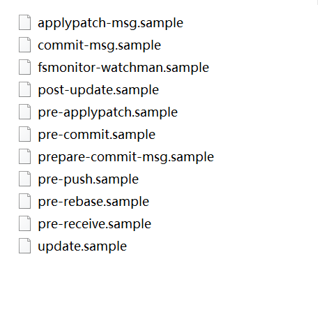

## git -分布式版本控制系统
---


### 查看配置
``` js
$ git config -l
core.symlinks=false
core.autocrlf=true
core.fscache=true
color.diff=auto
color.status=auto
color.branch=auto
color.interactive=true
help.format=html
rebase.autosquash=true
http.sslbackend=openssl
http.sslcainfo=C:/Program Files/Git/mingw64/ssl/certs/ca-bundle.crt
credential.helper=manager
user.name=haoff
user.email=981069925@qq.com
pull.rebase=false
core.repositoryformatversion=0
core.filemode=false
core.bare=false
core.logallrefupdates=true
core.symlinks=false
core.ignorecase=true
```

### 某一项配置
```js
设置  git config <?--global> "key" "value"
获取  git config "key"
```

### ssh 配置  
>  输入ssh-keygen  按三次`enter`  取  ***id_rsa.pub*** 文件


概念： 工作区，暂存区，远程仓库

### git 分支管理
+ git branch  查看本地分支
  + git branch -a 查看全部分支及本地远程关联情况
+ git checkout -b dev  创建并切换到Dev分支
  + git checkout -b dev origin/dev  创建并切换到Dev分支，并关联远程分支
+ git checkout dev  切换分支
+ git branch -D dev 删除dev分支
+ git merge name  合并name 分支到当前分支


### git提交代码

+ git status  
  + 查看本地状态【文件更改】
+ git checkout filename 取消文件改动
  + git checkout .  取消全部文件改动
+ git add flieName
  +  将工作区-filename文件添加到暂存区  
  +  git add .  添加全部文件到暂存区 
+ git commit -m "提交信息" 
  +  将暂存区内容数据移到本地分支
+ git pull 
  +  合并拉取分支关联远程分支，提前解决冲突
+ git push 
  +  将本地分支内容推向远程仓库关联分支
  +  本地分支未关联远程仓库分支   git push --set-upstream origin 远程分支名
+ git log 
  +  查看分支 git commit 记录
+ git reset --hard "commitId" 
  + 回退到指定commit版本
  
### git 钩子（hook）配置
---
 
 ---
+ 默认位置 .git\hooks   【.git 隐藏文件夹】
+ 修改
+ > .sample拓展名防止它们默认被执行。为了安装一个钩子，你只需要去掉.sample拓展名
+ 问题
  + 1. 该内容为脚本 
    + > python, bash 
    + > js > husky
      + Husky支持此处定义的所有Git钩子。服务器端挂钩（pre-receive，update和post-receive）不被支持。
  + 2. .git 文件 不属于git追踪文件

+ 常用钩子：  
> 本地
  + commit：<可终止commit> 
    + pre-commit(预先提交)
    + pre-merge-commit(合并前提交)
    + prepare-commit-msg(准备提交消息)
    + commit-msg(提交信息)
    + post-commit(提交信息完成) ----用于通知
  + push：<可终止push>
    + pre-push(预推)
> 远程
  + pre-receive(预接收)
  + update (更新远程) 
  + post-receive(更新完成)  
参考介绍git钩子：<http://www.mamicode.com/info-detail-2916910.html>

